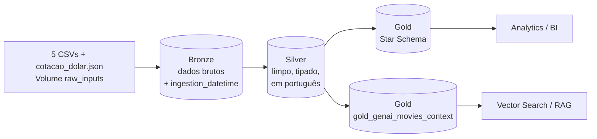
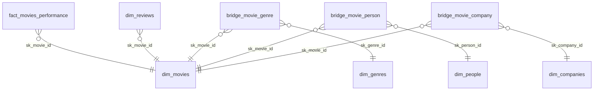

# 🎬 CineData Analytics — Pipeline de Dados End-to-End no Databricks

Pipeline ETL completo sobre um catálogo de filmes (base combinada **TMDB/IMDb**), construído no **Databricks Free Edition** seguindo a **Arquitetura Medalhão** (Bronze → Silver → Gold). O projeto entrega um **Star Schema** para o time de BI, uma **tabela de contexto para RAG** para o time de IA e um conjunto de **consultas analíticas** de negócio.

> Projeto desenvolvido no programa **Rocket Lab 2026 — Engenharia de Dados (Visagio)**.

---

## 📌 Contexto

A **CineData Analytics** é uma empresa fictícia de inteligência de mercado do setor audiovisual. Os dados brutos chegam **intencionalmente sujos e fragmentados** em 5 arquivos CSV, e o objetivo é transformá-los em dados confiáveis para:

- **BI:** modelagem dimensional (Star Schema) com métricas financeiras e de engajamento;
- **IA:** uma tabela de documentos em texto corrido para alimentar um **Vector Search** (RAG) de um assistente baseado em LLM;
- **Financeiro:** valores de orçamento e receita também em **Reais (BRL)**, usando a cotação PTAX do Banco Central.

---

## 🛠️ Tecnologias

| Tecnologia | Uso no projeto |
|---|---|
| **Databricks Free Edition** | Plataforma de desenvolvimento e execução |
| **Serverless Compute** | Execução dos notebooks e do Job (sem gerenciamento de clusters) |
| **Unity Catalog** | Governança em 3 níveis: `cinedata_analytics.{bronze, silver, gold}` |
| **Delta Lake** | Formato de todas as tabelas (append na Bronze, overwrite na Silver/Gold) |
| **PySpark / Spark SQL** | Transformações, limpeza, modelagem e analytics |
| **Databricks Workflows** | Orquestração do pipeline com dependências e agendamento |
| **API PTAX (Banco Central)** | Cotação do dólar para conversão USD → BRL |

---

## 📁 Estrutura do repositório

```
cinedata-analytics-databricks/
├── notebooks/
│   ├── Landing_to_Bronze.ipynb     # Ingestão dos CSVs e da cotação (Bronze)
│   ├── Bronze_to_Silver.ipynb      # Limpeza, tipagem e padronização (Silver)
│   └── Silver_to_Gold.ipynb        # Star Schema + contexto RAG + Analytics (Gold)
├── jobs/
│   └── job.yaml                    # Exportação do Job cinedata_etl_pipeline
├── docs/
│   ├── execucao_job.png            # Print da execução bem-sucedida do Job
│   ├── catalogo_bronze.png         # Tabelas da camada Bronze no Unity Catalog
│   ├── catalogo_silver.png         # Tabelas da camada Silver no Unity Catalog
│   └── catalogo_gold.png           # Tabelas da camada Gold no Unity Catalog
├── .gitignore
└── README.md
```

---

## 🏗️ Arquitetura Medalhão


### Estrutura no Unity Catalog

| Bronze | Silver | Gold |
|---|---|---|
|  |  |  |

### 🥉 Bronze — `Landing_to_Bronze`
- Lê os 5 CSVs do Volume `/Volumes/cinedata_analytics/bronze/raw_inputs/` **sem alteração de conteúdo** (todas as colunas como `STRING`, para não perder valores sujos antes do tratamento).
- Adiciona a coluna de auditoria `ingestion_datetime` e grava em **Delta, modo Append** (histórico de cargas).
- Leitura robusta para o padrão CSV RFC 4180 (`escape='"'`, `multiLine`). Com as opções padrão do Spark, cerca de 5 mil filmes seriam perdidos.
- Ingestão da cotação do dólar (PTAX) em `tb_cotacao_dolar`, com widgets documentando o período consultado (`MM-DD-AAAA`).

| Arquivo | Tabela Bronze |
|---|---|
| `movies_info*.csv` | `bronze.tb_movies_info` |
| `movies_financials_IMDB_TMDB.csv` | `bronze.tb_movies_financials` |
| `movies_metrics_IMDB_TMDB.csv` | `bronze.tb_movies_metrics` |
| `credits_and_tags_IMDB_TMDB.csv` | `bronze.tb_credits_and_tags` |
| `movies_reviews.csv` | `bronze.tb_movies_reviews` |
| `cotacao_dolar.json` (API PTAX) | `bronze.tb_cotacao_dolar` |

### 🥈 Silver — `Bronze_to_Silver`
Colunas em português, tipagem correta e regras de qualidade. Toda conversão usa `try_cast`/`try_to_timestamp`, porque o Serverless roda com **ANSI mode** e um `cast` comum quebraria o pipeline com dados sujos.

| Tabela | Principais tratamentos |
|---|---|
| `tb_info_filmes` | Deduplicação pela ingestão mais recente; status normalizado e traduzido; datas em 3 formatos (`AAAA-MM-DD`, `DD/MM/AAAA`, `MM-DD-AAAA`); títulos em caixa alta/baixa corrigidos; `ano_lancamento` derivado |
| `tb_financeiro_filmes` | Tokens de ausência → NULL; remoção de moeda e milhar; expansão de `K/M/B` (`34.0M` → 34.000.000); zero/negativo → NULL; conversão BRL; lucro e margem null-safe |
| `tb_metricas_engajamento` | Vírgula decimal corrigida; column shift tratado com cast seguro; notas fora de 0–10 e contagens negativas → NULL |
| `tb_avaliacoes_usuarios` | Duplicatas exatas removidas; nota fora de 0–10 → NULL; comentário vazio → `"Sem comentário"` |
| `tb_generos` | Separadores `,` `;` `\|` padronizados; split + explode; validação contra os 19 gêneros oficiais do TMDB |
| `tb_pessoas_empresas` | 4 colunas unificadas (`Ator`, `Diretor`, `Roteirista`, `Produtora`); resíduos de column shift removidos; capitalização padronizada |
| `tb_cotacao_dolar` | Série temporal contínua com **forward fill** para fins de semana e feriados |

### 🥇 Gold — `Silver_to_Gold`

#### Star Schema



| Tabela | Tipo | Descrição |
|---|---|---|
| `fact_movies_performance` | Fato | **1 linha por filme lançado**. Métricas financeiras (`DECIMAL(18,2)`, USD e BRL) e de engajamento (popularidade, notas e votos TMDB/IMDb) |
| `dim_movies` | Dimensão | Metadados descritivos de todos os filmes do catálogo |
| `dim_genres` | Dimensão | Catálogo único de gêneros |
| `dim_people` | Dimensão | Pessoas físicas (`Ator`, `Diretor`, `Roteirista`) |
| `dim_companies` | Dimensão | Produtoras/estúdios |
| `dim_reviews` | Dimensão | Resumo das avaliações de usuários por filme (quantidade e nota média) |
| `bridge_movie_genre` / `_person` / `_company` | Bridge | Relações N:N entre filmes e dimensões periféricas |

**Decisões de modelagem:**
- **Surrogate keys via `sha2`** convertido para `BIGINT`: são **determinísticas**, então o mesmo filme recebe sempre a mesma chave em qualquer execução. Com `row_number()` ou `monotonically_increasing_id()`, as chaves mudariam entre execuções.
- **Bridge tables** evitam a explosão de linhas na fato: somar a receita após um join direto com gêneros triplicaria o total (US$ 484 bi em vez de US$ 162 bi).
- O notebook **valida** a unicidade das chaves, o grão da fato e a integridade referencial (0 órfãos nas 8 FKs) antes de publicar.

#### Tabela de contexto para RAG — `gold_genai_movies_context`

| Coluna | Descrição |
|---|---|
| `movie_id` | Chave natural do filme |
| `title` | Título |
| `llm_context_document` | Documento em texto corrido para vetorização |

Exemplo gerado:

> O filme Dangal, lançado no ano de 2016, faturou US$ 311.000.000 e teve um custo de US$ 10.400.000. Estrelado por Aparshakti Khurana, Girish Kulkarni, Sanya Malhotra, Aamir Khan e Vivan Bhatena e dirigido por Nitesh Tiwari, o filme possui a seguinte sinopse: ...

**Tratamento de nulos:** `concat()` retorna `NULL` se qualquer campo for nulo, o que faria o filme sumir silenciosamente. Cada campo recebe `coalesce()` com um fallback (`"valor não divulgado"`, `"diretor não informado"`, `"Sinopse não disponível."`...) **antes** da concatenação. Resultado: **97.611 documentos para 97.611 filmes, 0 nulos**. A tabela tem **Change Data Feed** habilitado, requisito para um índice Delta Sync do Vector Search.

---

## 📊 Analytics

Consultas em Spark SQL no final do `Silver_to_Gold`:

1. Receita total (R$) de todos os filmes
2. Top 5 filmes por popularidade
3. Quantidade de filmes por gênero
4. Top 10 filmes por receita com `RANK()`
5. Ator com mais participações nos últimos 2 anos
6. Produtora com maior lucro nos últimos 5 anos

Nas perguntas 5 e 6, a janela de tempo é relativa à **data de lançamento realizada mais recente da base** (e não à data atual), ignorando filmes não lançados e datas futuras.

---

## ⚙️ Orquestração

Job **`cinedata_etl_pipeline`** (`jobs/job.yaml`), executado em **Serverless**:

```
to_Bronze  ──►  to_Silver  ──►  to_Gold
```

- Dependências explícitas: cada task só inicia após o **sucesso** da anterior.
- Agendamento diário às **03:00 (America/Sao_Paulo)**, simulando uma rotina de produção.


---

## ▶️ Como executar

1. **Criar a estrutura no Unity Catalog** (SQL Editor ou notebook):
   ```sql
   CREATE CATALOG IF NOT EXISTS cinedata_analytics;
   CREATE SCHEMA IF NOT EXISTS cinedata_analytics.bronze;
   CREATE VOLUME IF NOT EXISTS cinedata_analytics.bronze.raw_inputs;
   ```
2. **Enviar os arquivos de entrada** para o Volume (`Catalog → cinedata_analytics → bronze → raw_inputs → Upload`): os 5 CSVs e o `cotacao_dolar.json`.
3. **Importar os notebooks** da pasta `notebooks/` no Workspace (`Import → .ipynb`).
4. **Executar** na ordem `Landing_to_Bronze` → `Bronze_to_Silver` → `Silver_to_Gold`, ou criar o Job a partir de `jobs/job.yaml`, ajustando os caminhos dos notebooks para o seu usuário.

---

## ⚠️ Limitações conhecidas

- **Cotação via arquivo:** o Free Edition restringe o acesso de saída à internet a partir do Serverless. A resposta da API PTAX foi obtida pelo endpoint oficial e salva como `cotacao_dolar.json` no Volume. A Silver estende a série até a data de execução com forward fill.
- **Conversão BRL:** os filmes não têm data de transação, então é aplicada a **cotação mais recente** disponível (valor atual em reais).
- **Filmes duplicados com ids diferentes:** a origem tem o mesmo filme cadastrado com vários ids (ex.: 25 ids para *Die Hart 2: Die Harter*). A deduplicação da Silver segue a regra do escopo (por id); nas perguntas 5 e 6 a contagem é feita por obra (título + data).
- **Atores principais no RAG:** a ordem de créditos não existe no modelo; são usados os 5 atores com mais filmes no catálogo como aproximação de relevância.
- **Column shift:** a limpeza remove os resíduos frequentes (textos, números, países e idiomas deslocados), mas ocorrências raras podem permanecer.
